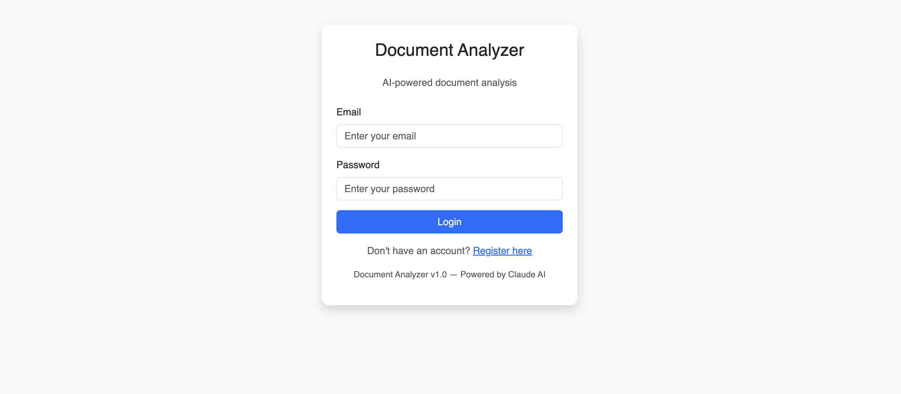
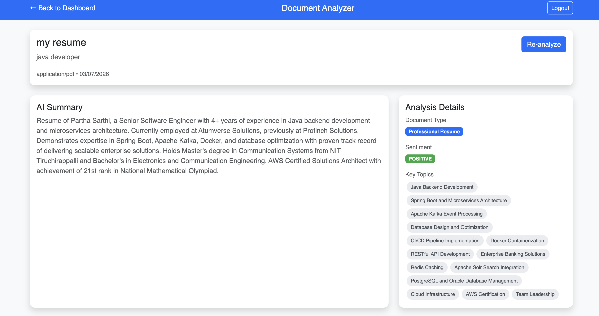
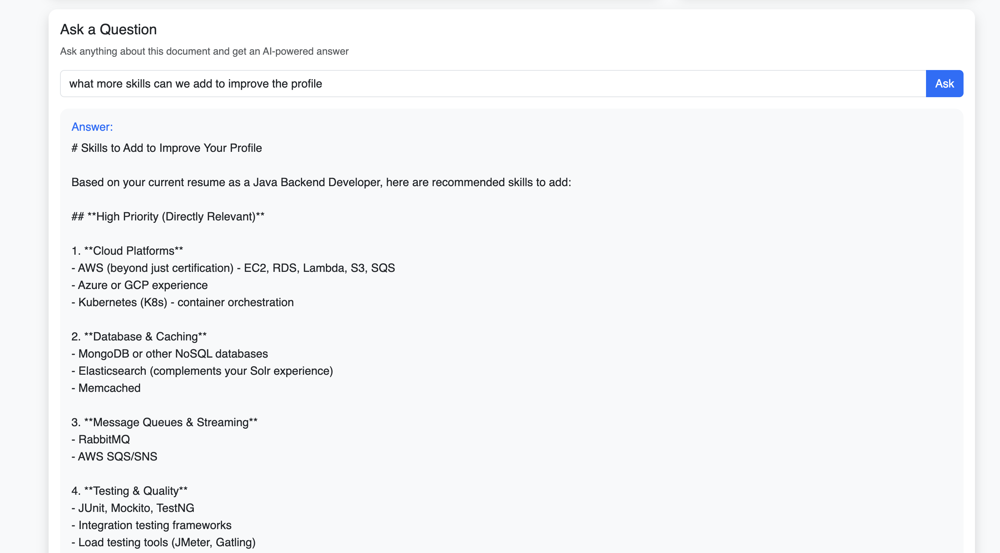
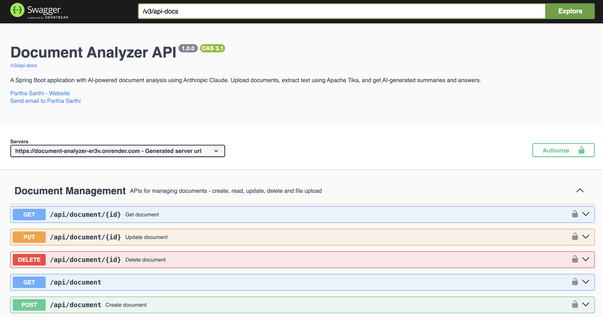
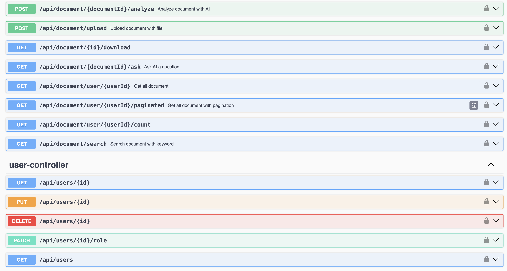
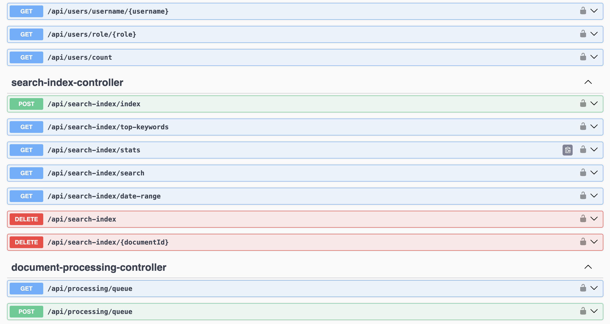
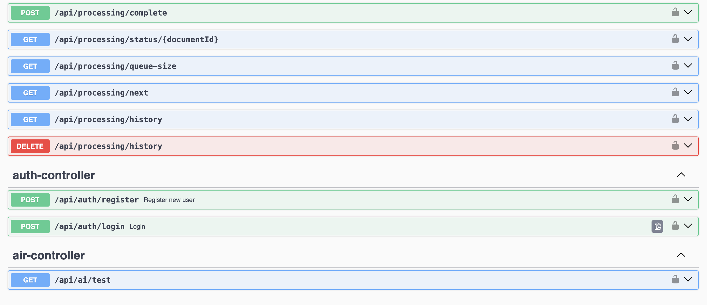

# Document Analyzer

An AI-powered document management system built with Spring Boot and Spring AI, integrated with Anthropic Claude for intelligent document analysis, summarization, and Q&A.

**Live Demo:** [https://codewordpartha.github.io/documentAnalyzer](https://codewordpartha.github.io/documentAnalyzer)

**API Documentation:** [Swagger UI](https://document-analyzer-er3v.onrender.com/swagger-ui/index.html)

---

## Screenshots

### Login Page


### Dashboard


### AI Analysis


### Ask a Question


### API Documentation (Swagger)








---

## Features

- **JWT Authentication** — Secure register/login with role-based access control
- **Document Management** — Upload, view, update, and soft-delete documents
- **File Upload & Text Extraction** — Upload PDF, Word, TXT files with automatic text extraction using Apache Tika
- **AI-Powered Analysis** — Structured document analysis using Anthropic Claude returning:
  - Summary
  - Document Type
  - Sentiment (POSITIVE / NEGATIVE / NEUTRAL)
  - Key Topics
- **AI Q&A** — Ask any question about a document and get an intelligent answer
- **In-Memory Search Index** — Inverted keyword index for fast content-based search
- **Title Search** — Search documents by title using PostgreSQL
- **Top Keywords** — View most frequent keywords across your documents (per user)
- **Priority Queue Processing** — Document processing queue with priority-based ordering
- **Rate Limiting** — Per-user API rate limiting using Bucket4j (5 AI requests/minute)
- **Swagger UI** — Complete interactive API documentation

---

## Tech Stack

### Backend
| Technology | Purpose |
|---|---|
| Java 17 | Core language |
| Spring Boot 3.5 | Application framework |
| Spring AI 1.0 | AI integration layer |
| Anthropic Claude | AI model (claude-haiku-4-5) |
| Spring Security | Authentication & authorization |
| JWT (JJWT 0.12.3) | Token-based authentication |
| Spring Data JPA | Database ORM |
| PostgreSQL | Relational database |
| Apache Tika | File content extraction |
| Bucket4j | Rate limiting |
| SpringDoc OpenAPI | API documentation |
| Lombok | Boilerplate reduction |

### Frontend
| Technology | Purpose |
|---|---|
| HTML5 / CSS3 | Structure and styling |
| JavaScript (ES6+) | Client-side logic |
| Bootstrap 5 | UI components |
| Fetch API | HTTP calls to backend |

### DevOps
| Technology | Purpose |
|---|---|
| Docker | Containerization |
| Render.com | Backend deployment |
| GitHub Pages | Frontend deployment |

---

## Architecture

```
┌─────────────────────────────────────────────────────────┐
│                     Frontend (GitHub Pages)             │
│              HTML + JavaScript + Bootstrap              │
└──────────────────────────┬──────────────────────────────┘
                           │ HTTP/REST
                           ▼
┌─────────────────────────────────────────────────────────┐
│                Spring Boot Backend (Render)             │
│                                                         │
│  ┌─────────────┐  ┌──────────────┐  ┌───────────────┐   │
│  │ Controllers │  │   Services   │  │    Filters    │   │
│  │             │  │              │  │               │   │
│  │ Auth        │  │ DocumentSvc  │  │ JwtAuth       │   │
│  │ Document    │  │ AiAnalysis   │  │ Filter        │   │
│  │ Processing  │  │ SearchIndex  │  │               │   │
│  │ SearchIndex │  │ RateLimiter  │  │               │   │
│  └─────────────┘  └──────────────┘  └───────────────┘   │
│                           │                             │
│              ┌────────────┼────────────┐                │
│              ▼            ▼            ▼                │
│        ┌──────────┐ ┌──────────┐ ┌──────────┐           │
│        │PostgreSQL│ │Anthropic │ │In-Memory │           │
│        │    DB    │ │Claude API│ │  Index   │           │
│        └──────────┘ └──────────┘ └──────────┘           │
└─────────────────────────────────────────────────────────┘
```

---

## Java Concepts Demonstrated

### Collections Framework
| Collection | Where Used | Why |
|---|---|---|
| `PriorityQueue` | DocumentProcessingService | Priority-based task ordering |
| `ConcurrentHashMap` | DocumentProcessingService, RateLimiterService | Thread-safe status tracking |
| `LinkedList` | DocumentProcessingService | FIFO processing history |
| `HashMap` | SearchIndexService | O(1) document lookup |
| `TreeMap` | SearchIndexService | Sorted date-range queries |
| `HashSet` | SearchIndexService | Unique document IDs per keyword |

### Spring AI Features
- `ChatClient` — modern Spring AI API for calling Claude
- `PromptTemplate` — external `.st` prompt files (no hardcoded prompts)
- `BeanOutputConverter` — structured JSON output mapped to Java records
- System/User prompt separation
- Token-based cost awareness with rate limiting

### Security
- JWT token generation and validation
- `OncePerRequestFilter` for request interception
- `SecurityFilterChain` with stateless session management
- BCrypt password encoding
- CORS configuration

### Design Patterns
- Repository pattern (Spring Data JPA)
- DTO pattern (request/response separation)
- Service layer pattern
- Soft delete pattern
- Builder pattern (JWT, Bucket)

---

## Running Locally

### Prerequisites
- Java 17+
- Maven
- PostgreSQL
- Anthropic API key

### Backend Setup

1. Clone the repository:
```bash
git clone https://github.com/CodeWordPartha/documentAnalyzer.git
cd documentAnalyzer
```

2. Create PostgreSQL database:
```sql
CREATE DATABASE docanalyzer;
```

3. Create `src/main/resources/application.properties`:
```properties
spring.application.name=document-analyzer
spring.datasource.url=jdbc:postgresql://localhost:5432/docanalyzer
spring.datasource.username=your_username
spring.datasource.password=your_password

spring.jpa.hibernate.ddl-auto=update
spring.jpa.properties.hibernate.dialect=org.hibernate.dialect.PostgreSQLDialect

server.port=8081

spring.servlet.multipart.max-file-size=10MB
spring.servlet.multipart.max-request-size=10MB
spring.servlet.multipart.enabled=true
file.upload-dir=./uploads

spring.ai.anthropic.api-key=your_anthropic_api_key
spring.ai.anthropic.chat.options.model=claude-haiku-4-5-20251001
spring.ai.anthropic.chat.options.temperature=0.7
spring.ai.anthropic.chat.options.max-tokens=4096

jwt.secret=your_base64_encoded_secret
jwt.expiration=86400000
```

4. Run the application:
```bash
./mvnw spring-boot:run
```

Backend runs on `http://localhost:8081`

### Frontend Setup

1. Update `Frontend/app.js`:
```javascript
const BASE_URL = 'http://localhost:8081';
```

2. Open `Frontend/index.html` in browser

---

## API Endpoints

### Authentication
| Method | Endpoint | Description |
|---|---|---|
| POST | `/api/auth/register` | Register new user |
| POST | `/api/auth/login` | Login and get JWT token |

### Documents
| Method | Endpoint | Description |
|---|---|---|
| POST | `/api/document` | Create document |
| POST | `/api/document/upload` | Upload file with text extraction |
| GET | `/api/document/user/{userId}` | Get all user documents |
| GET | `/api/document/{id}` | Get document by ID |
| PUT | `/api/document/{id}` | Update document |
| DELETE | `/api/document/{id}` | Soft delete document |
| GET | `/api/document/search` | Search by title |

### AI Features
| Method | Endpoint | Description |
|---|---|---|
| POST | `/api/document/{id}/analyze` | AI analysis (rate limited: 5/min) |
| GET | `/api/document/{id}/ask` | Ask question about document |

### Search Index
| Method | Endpoint | Description |
|---|---|---|
| GET | `/api/search-index/search` | Search by content keywords |
| GET | `/api/search-index/top-keywords` | Get top keywords per user |
| GET | `/api/search-index/stats` | Index statistics |

### Processing Queue
| Method | Endpoint | Description |
|---|---|---|
| POST | `/api/processing/queue` | Queue a document task |
| GET | `/api/processing/next` | Get next priority task |
| GET | `/api/processing/status/{id}` | Get task status |
| GET | `/api/processing/history` | Processing history |

> Full interactive documentation available at [Swagger UI](https://document-analyzer-er3v.onrender.com/swagger-ui/index.html)

---

## AI Integration Details

Documents are analyzed using **Anthropic Claude** via Spring AI. The analysis returns structured output:

```json
{
  "summary": "Brief 2-3 sentence summary of the document",
  "documentType": "resume / financial report / offer letter / etc.",
  "sentiment": "POSITIVE / NEGATIVE / NEUTRAL",
  "keyTopics": ["topic1", "topic2", "topic3"]
}
```

Prompts are stored externally in `.st` files under `src/main/resources/prompts/` — no hardcoded prompts in Java code.

---

## Known Limitations

- **In-memory search index** resets on server restart (free tier limitation)
- **Uploaded files** are not persisted after server restart (ephemeral filesystem on Render free tier)
- **Cold start delay** — Render free tier spins down after inactivity, first request may take 30-60 seconds
- File content is permanently stored in PostgreSQL DB — AI features work even after restart

---

## Author

**Partha Sarthi**
- GitHub: [@CodeWordPartha](https://github.com/CodeWordPartha)
- LinkedIn: [www.linkedin.com/in/parthas9896]

---

## License

This project is for educational and portfolio purposes.
